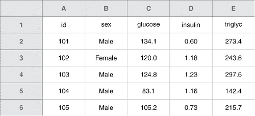
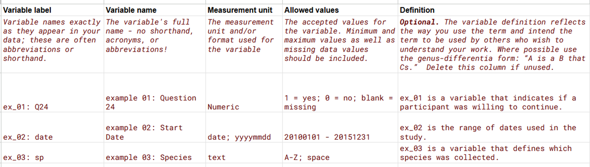

# Collecting and Organizing Data

**We do not clean messy data because our expertise is in analysis.**

Underlying principle: be kind to your future self 

## Where does your data come from? 

Pitfalls: 
Missing data
Inconsistent data -> untrustworthy conclusions 
Failing to capture data on an important explanatory variable 

How data arises is extremely important for what it can tell you

## Data Collection 
Plan and test data collection procedures before collecting data
Statistical Consulting can advise on experimental or study design
If possible, run a mini experiment / pilot study before the real one 

Use consistent data collection procedures 
Train your data collectors & calibrate your equipment 
Thoroughly document your procedures 
Collect “extra” data 
Record the observer, time / dates of collection, etc., etc., etc. 
Even though these data aren’t typically used in analysis, they’re still important to record!
This also helps with the data documentation as well 

Researches often start with scientific questions 
Is treatment A better than treatment B? 
How can farmers maximize their yield?
Experiential design helps researchers test their hypotheses while controlling for external variation
Hindsight is 20/20 for a poorly designed experiment 
Confounding – not able to distinguish between the treatment and other aspects of the experiment (i.e. day of testing)
Random may not be what you think is random
Scientific conclusions are constrained by the experiment

## Data Entry 

Enter and backup data ASAP!

Make your spreadsheet look like your paper data collection sheet
Make the paper data collection sheet and the digital data sheet look as similar as possible. You can write code to merge these digital sheets together. 

Use simple formats in Excel
Keep all raw data in a tab separate from analysis or graphs 
Margining cells or other formatting will confuse statistical software

Use consistent coding and column names
For example, don’t change from “Y” to “Yes” 

Be consistent!

## Messy Data?

.](images/messy_data.png)

How to clean it yourself? R's `dplyr` and data validation in Excel are your friends.

## Data Validation  

How to check if data is cleaned?

-   Randomly select rows and seeing if they "make sense"

-   Look at summary statistics, especially outliers

-   Create exploratory plots

Look for missing data! 

Unique category values
Cross-validate

If you are transcribing from paper to digital data, you can have two people enter the data and cross-validate

## Spreadsheet Best Practices

> "...spreadsheets are best suited to data entry and storage, and that analysis and visualization should happen separately." [@broman2018]

### Highlighted Best Practices

-   Keep **raw data raw**

    -   Never do analysis in the same tab as raw data!

    -   Lock tabs containing raw data

-   The **less pretty the spreadsheet, the better**

    -   Use simple .csv format

    -   Never merge cells

    -   Only have 1 thing in a cell

    -   Do not use formatting as data (i.e. highlighting)

-   Start fresh with a blank spreadsheet

    -   Never write over old data to "keep the formatting"

### More Advice from @broman2018

“a standard way of mapping the meaning of a dataset to its structure.” –Hadley Wickham in the paper Tidy Data https://vita.had.co.nz/papers/tidy-data.pdf

Tidy Data (cite paper)
Each variable forms a column
Each observation forms a row
Each cell is a single measurement

Also mentioned earlier in the panel: the extra rows and columns might make things look nice, but they break the tidy data principle. 
Another common thing to change is instead of color coding, use another column for labeling.

::: panel-tabset
## Make Data a Rectangle

-   Rows correspond to subjects, columns correspond to variables.
-   The first row is variable names. Never use multiple rows for variable names.

## Choose Good Names for Things

-   Choose *short but meaningful* names

-   Do not use spaces, either in variable names or file names

-   Be careful about extraneous spaces at the beginning or end of a variable name

-   Avoid special characters, except for underscores and hyphens

## Be Consistent

-   Use consistent codes for categorical variables

-   Use a consistent fixed code for any missing values

-   Use consistent variable names across files

-   Use consistent subject identifiers

-   Use consistent file names

-   Use consistent phrases in your notes

## Dates

-   Write Dates as YYYY-MM-DD (ISO 8601 standard)

-   Microsoft Excel’s treatment of dates can cause problems in data

:::

## Data Codebook

An [example of a data codebook from 538](https://github.com/fivethirtyeight/data/tree/master/comic-characters).

Get this [data codebook template](https://docs.google.com/spreadsheets/d/16EdbqTWgQz3vyAHUC5eVHv2tvS511p13BhybKnKt7F8/edit?gid=0#gid=0).

## Modifying and Reformatting Data

Software like `R` and `Python` makes this easy. Never do this in Excel (remember, keep raw data raw!) The most important thing is to have your data clean and in a good format, worry about transforming it later!

In `R`, you can subset, filter, and pivot data.

How you format data will depend on analysis and plotting... You can reformat in multiple way. `pivot_wider` and `pivot_longer` are especially helpful for this. 

To learn more, see [5 Data Tidying](https://r4ds.hadley.nz/data-tidy.html) in @wickham2017r

Backup your data (use a SSD and cloud storage), use version control with services like Git. (link to using Git in R)
